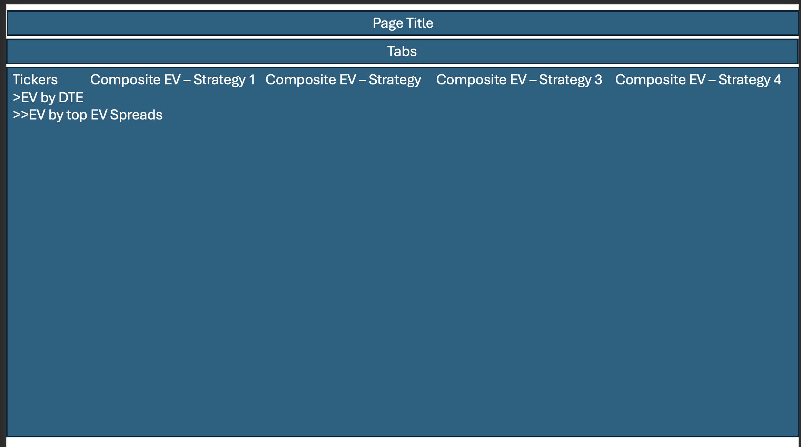
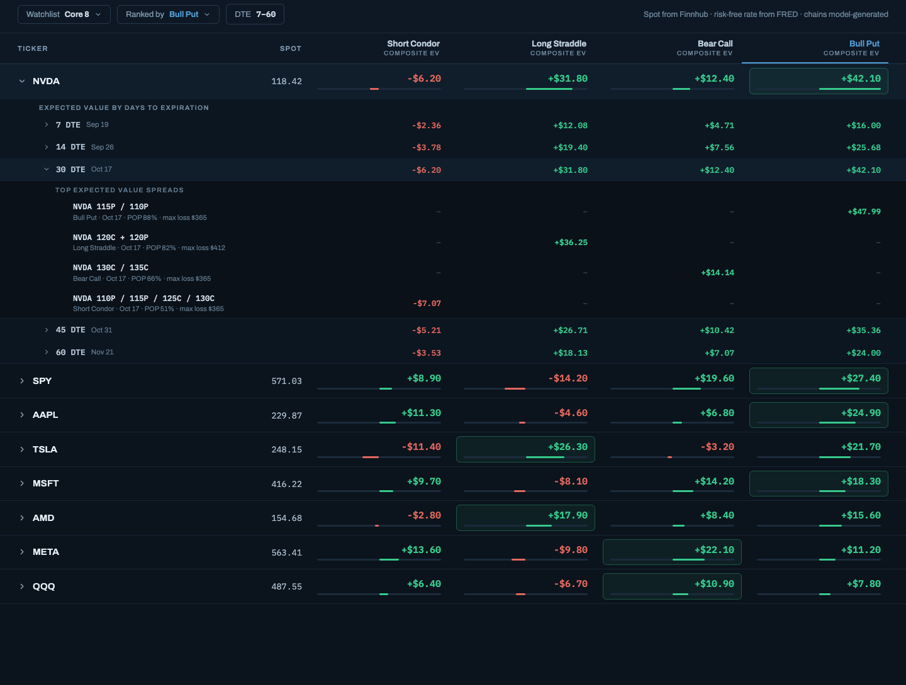
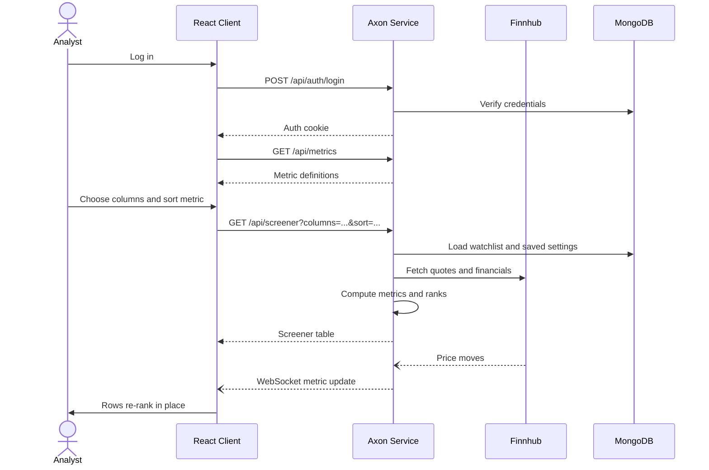

# Axon Trading House

[My Notes](notes.md)

Axon Trading House is a proprietary trading firm buying and selling public securities: equities, options, and bonds. This application focuses on the research side of the business: defining the metrics that matter, then screening, ranking, and monitoring companies against them.

### Elevator pitch

Every stock screener hands you the same fixed list of numbers, computed some way you can't see. Analysts end up exporting to spreadsheets, rebuilding the metrics they actually care about, and re-sorting by hand every time a price moves. Axon Trading House flips that around. Every metric is **defined in the open**, on a Metrics page that shows its formula and the raw fields it is built from, so you know exactly what a number means before you rank on it. The screener lets you pick any set of those metrics as columns, filter the company list, and sort or rank on whichever one you care about. Prices and the metrics that depend on them update live as the market moves, so the ranking in front of you is the ranking right now, not the one from when the page loaded.

### Design

The application has two main views, reached from a navigation bar under the page header.

The **Screener** is a table with one row per company and one column per selected metric. Above it, a filter narrows the company list, a column picker chooses which metrics to show, a sort control picks the metric and direction, and a Values / Ranks toggle switches each cell between the metric's value and the company's rank on it. A dash means a value could not be computed (a missing input), which is different from zero.

The **Metrics** page is the dictionary behind the screener. Each row is one metric or raw data field: its display name, its identifier (for example `net_margin`), its kind (a computed metric, or a raw flow, stock, rate, or label field), its grain (annual or quarterly), and its coverage, meaning the share of companies that have a usable value. Opening a metric shows its formula and the raw fields it reads. Anything defined here can be chosen as a screener column.

A **Watchlist** page holds each user's saved tickers and saved screener setups, and an **About** page explains how metrics are built.

The sketches below are from the original options expected-value concept. The header, navigation, and ranked-table layout carried over into the metric screener.

**Template**

**Screener mockup**

This sequence shows what happens when a user opens the screener and the market moves underneath them.

### Key features

- Secure login over HTTPS, with each user's watchlist and settings stored server side
- A Metrics page that defines every metric in the open: name, identifier, kind, grain, coverage, formula, and the raw fields it is built from
- A screener where the user picks any set of defined metrics as columns and filters the company list
- Sorting and ranking on any metric, with a Values / Ranks toggle
- Missing values shown as a dash with the reason, never silently treated as zero
- Per-user watchlists and saved screener setups that persist between sessions and across devices
- Live price-driven metrics (such as price / earnings) pushed to every open client as prices move, so rankings re-sort without a refresh

### Technologies

I am going to use the required technologies in the following ways.

- **HTML** - Separate pages for login, the screener, the metrics dictionary, the watchlist, and about, structured with correct semantic elements: `header`, `nav`, `main`, and `footer` on every page, real `table` elements for the screener and the metric definitions, and `form`, `fieldset`, and `details`/`summary` for the controls and formula breakdowns.
- **CSS** - Styling the whole application. A dark trading-desk palette with negative values in red, an imported font, and a layout built on flexbox and grid so the screener stays readable on a phone by showing fewer metric columns. Live value changes are animated so the analyst can see what just moved.
- **React** - The frontend becomes a single page application built from components: a login form, the navigation bar, the screener controls, the screener table, the metrics table, and a metric detail view. React Router swaps between the views. Component state drives column selection, sorting, the Values / Ranks toggle, and re-rendering rows the moment new values arrive over the WebSocket.
- **Service** - A Node/Express backend providing these endpoints:
  - `POST /api/auth/register`, `POST /api/auth/login`, `DELETE /api/auth/logout` for account management
  - `GET /api/metrics` returning every metric definition with its formula, kind, grain, and coverage
  - `GET /api/screener` returning the selected metrics for every company, sorted and ranked
  - `GET /api/watchlist` and `PUT /api/watchlist` for reading and updating the user's tickers and saved screener setups
  - Third party calls to [Finnhub](https://finnhub.io/docs/api) for stock quotes and company financials, the raw fields the metrics are computed from.
- **DB/Login** - MongoDB stores user accounts with securely hashed passwords, each user's watchlist, and their saved screener setups. Users register and log in before reaching the screener; an unauthenticated visitor cannot load screener data or modify a watchlist.
- **WebSocket** - As prices move, the backend recomputes the price-driven metrics and pushes the updated values to every connected client. Rows re-rank live, so all open clients see the same ordering at the same time without polling or refreshing.

## 🚀 Specification Deliverable

For this deliverable I built out the full specification for Axon Trading House in this `README.md`.

- [x] I completed the prerequisites for this deliverable (Git commit requirement)
- [x] Proper use of Markdown - Headings, bulleted and nested lists, a task list, bold and inline code, hyperlinks, a fenced Mermaid diagram, and an embedded image reference.
- [x] A concise and compelling elevator pitch - A single paragraph framing the problem (chains show price but not edge) and the fix (an expected value ranked screener that updates live).
- [x] Description of key features - Seven bullets covering login, the ranked screener grid, drill-down by expiration and spread, sortable strategy columns, persistent watchlists, live updates, and model-generated chains.
- [x] Description of how you will use each technology including your 3rd party API and use of WebSocket - A bullet per technology above. The 3rd party APIs are [Finnhub](https://finnhub.io/docs/api/quote) for stock quotes and [FRED](https://fred.stlouisfed.org/docs/api/fred/) for the risk-free rate. WebSocket pushes rescored expected values to every open client as prices move.
- [x] One or more rough sketches of your application. Images must be embedded in this file using Markdown image references. - Two images are embedded above: `screener-sketch.png`, the original wireframe of the page title, tab bar, ticker-by-strategy grid and the two levels of expandable rows, and `screener-mockup.png`, a full mockup of that same screen with a ticker and an expiration expanded.

## 🚀 AWS deliverable

For this deliverable I did the following. I checked the box `[x]` and added a description for things I completed.

- [ ] **Rented EC2 server** - I did not complete this part of the deliverable.
- [ ] **Leased domain name** - I did not complete this part of the deliverable.
- [ ] **Server accessible** from my domain: [https://yourdomainnamehere.click](https://yourdomainnamehere.click) - I did not complete this part of the deliverable.

## 🚀 HTML deliverable

For this deliverable I did the following. I checked the box `[x]` and added a description for things I completed.

- [ ] I completed the prerequisites for this deliverable (Simon deployed, GitHub link, Git commits) - A link to this GitHub repository is in the footer of every page, including the home page. The work is spread across many small commits. Simon HTML deployment is pending.
- [x] **HTML pages** - Five pages, one per component: `index.html` (login), `screener.html` (the metric screener), `metrics.html` (the metric definitions), `watchlist.html` (saved tickers and screener setups), and `about.html`.
- [x] **Proper HTML element usage** - Every page uses `body` with `header`, `nav`, `main`, and `footer`. The screener and metric definitions are real `table` elements with `thead`, `tbody`, `caption`, and `th scope`. The controls use `form`, `fieldset`, `legend`, `label`, `select`, radio buttons, and checkboxes. Formulas use `details`/`summary`, coverage uses `meter`, and page sections use `section` and `aside`.
- [x] **Links** - The `nav` on every page links to all five pages. Logging in on `index.html` goes to the screener. The screener links to the Metrics page, and each saved setup on the Watchlist links to the screener.
- [x] **Text** - Each page explains itself. The screener explains columns, sorting, ranks, and what a dash means. The Metrics page defines coverage, kind, and grain. The About page explains why metrics are defined in the open and how a metric is built. Pages with sample data carry a "sample data, not investment advice" notice.
- [x] **3rd party API placeholder** - The screener's Data source box names [Finnhub](https://finnhub.io/docs/api) as the source for quotes and financial statement fields, marked as not yet connected. Each raw field on the Metrics page is labeled "Raw field from Finnhub".
- [x] **Images** - `logo.svg` is in the header of every page. `metric-flow.svg` on the About page diagrams raw fields feeding metrics feeding the screener.
- [x] **Login placeholder** - `index.html` has a username and password form with Log in and Create account buttons. Every other page shows "Signed in as: analyst" in the header.
- [x] **DB data placeholder** - The Watchlist page shows the saved tickers and saved screener setups stored in the database for the user. The Metrics page's coverage values are computed from stored data.
- [x] **WebSocket placeholder** - The screener's Live updates list shows timestamped price moves pushed from the server and how they change price-driven metrics such as price / earnings.

## 🚀 CSS deliverable

For this deliverable I did the following. I checked the box `[x]` and added a description for things I completed.

- [ ] I completed the prerequisites for this deliverable (Simon deployed, GitHub link, Git commits)
- [ ] **Visually appealing colors and layout. No overflowing elements.** - I did not complete this part of the deliverable.
- [ ] **Use of a CSS framework** - I did not complete this part of the deliverable.
- [ ] **All visual elements styled using CSS** - I did not complete this part of the deliverable.
- [ ] **Responsive to window resizing using flexbox and/or grid display** - I did not complete this part of the deliverable.
- [ ] **Use of a imported font** - I did not complete this part of the deliverable.
- [ ] **Use of different types of selectors including element, class, ID, and pseudo selectors** - I did not complete this part of the deliverable.

## 🚀 React part 1: Routing deliverable

For this deliverable I did the following. I checked the box `[x]` and added a description for things I completed.

- [ ] I completed the prerequisites for this deliverable (Simon deployed, GitHub link, Git commits)
- [ ] **Bundled using Vite** - I did not complete this part of the deliverable.
- [ ] **Components** - I did not complete this part of the deliverable.
- [ ] **Router** - I did not complete this part of the deliverable.

## 🚀 React part 2: Reactivity deliverable

For this deliverable I did the following. I checked the box `[x]` and added a description for things I completed.

- [ ] I completed the prerequisites for this deliverable (Simon deployed, GitHub link, Git commits)
- [ ] **All functionality implemented or mocked out** - I did not complete this part of the deliverable.
- [ ] **Hooks** - I did not complete this part of the deliverable.

## 🚀 Service deliverable

For this deliverable I did the following. I checked the box `[x]` and added a description for things I completed.

- [ ] I completed the prerequisites for this deliverable (Simon deployed, GitHub link, Git commits)
- [ ] **Node.js/Express HTTP service** - I did not complete this part of the deliverable.
- [ ] **Static middleware for frontend** - I did not complete this part of the deliverable.
- [ ] **Calls to third party endpoints** - I did not complete this part of the deliverable.
- [ ] **Backend service endpoints** - I did not complete this part of the deliverable.
- [ ] **Frontend calls service endpoints** - I did not complete this part of the deliverable.
- [ ] **Supports registration, login, logout, and restricted endpoint** - I did not complete this part of the deliverable.
- [ ] **Uses BCrypt to hash passwords** - I did not complete this part of the deliverable.

## 🚀 DB deliverable

For this deliverable I did the following. I checked the box `[x]` and added a description for things I completed.

- [ ] I completed the prerequisites for this deliverable (Simon deployed, GitHub link, Git commits)
- [ ] **Stores data in MongoDB** - I did not complete this part of the deliverable.
- [ ] **Stores credentials in MongoDB** - I did not complete this part of the deliverable.

## 🚀 WebSocket deliverable

For this deliverable I did the following. I checked the box `[x]` and added a description for things I completed.

- [ ] I completed the prerequisites for this deliverable (Simon deployed, GitHub link, Git commits)
- [ ] **Backend listens for WebSocket connection** - I did not complete this part of the deliverable.
- [ ] **Frontend makes WebSocket connection** - I did not complete this part of the deliverable.
- [ ] **Data sent over WebSocket connection** - I did not complete this part of the deliverable.
- [ ] **WebSocket data displayed** - I did not complete this part of the deliverable.
- [ ] **Application is fully functional** - I did not complete this part of the deliverable.
