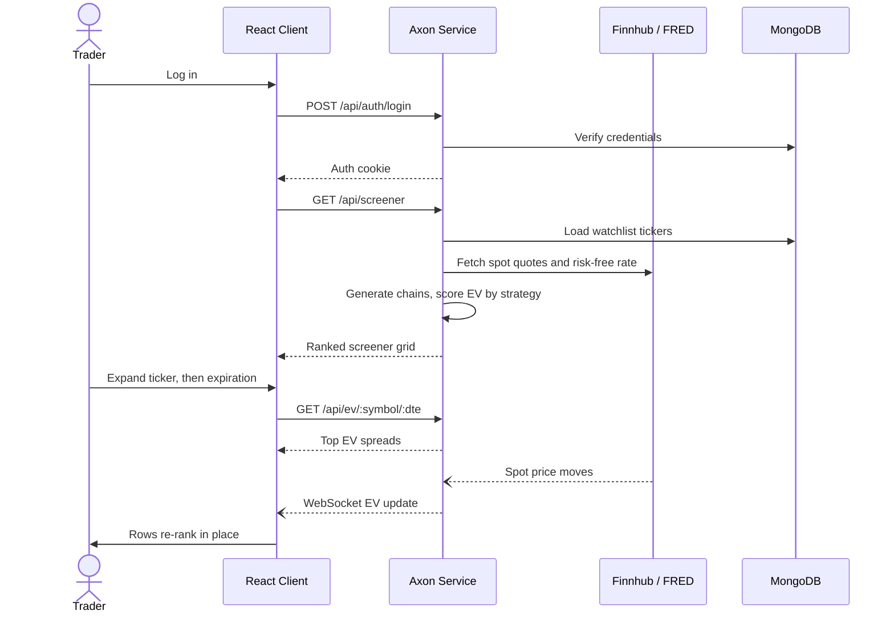

# Axon Trading House

[My Notes](notes.md)

Axon Trading House is a proprietary trading firm buying and selling public securities: equities, options, and bonds. This application focuses on the options analysis side of the business: finding, ranking, and monitoring the option trades.

### Elevator pitch

Every options platform will happily tell you what a contract costs. Almost none of them will tell you whether it is worth buying. Traders end up eyeballing chains of hundreds of strikes, guessing at which expiration and which structure gives them an edge, and finding out weeks later that they were wrong. Axon Trading House flips that around. It scores an entire watchlist of tickers on **expected value** across four defined strategies at once, ranks them in a single screener, and lets you drill from a ticker into the expirations that carry the edge and then into the specific spreads that produce it. Prices and expected values update live as the market moves, so the ranking in front of you is the ranking right now, not the one from when the page loaded. Instead of hunting for a trade, you open Axon and the trades are already sorted best-first.

### Design

The main view is a screener. A header names the page, a tab bar switches between views, and the body is a ranked grid: one row per ticker, one column per strategy, each cell holding that ticker's composite expected value for that strategy. Rows expand in place — clicking a ticker (`>`) opens its expected value broken out by days to expiration, and clicking an expiration (`>>`) opens the individual spreads that scored highest for that strategy and expiration. Sorting on any strategy column reorders the whole board, so the best opportunity for the structure you care about is always at the top.

The first sketch is the original wireframe that set the structure, and the second is the mockup built from it.

**Template**

**Screener mockup**

The mockup shows all three levels open at once: NVDA expanded into expected value by days to expiration, and its 30 DTE bucket expanded into the individual spreads behind that number. Values shown are sample data.

This sequence shows what happens when a user opens the screener and the market moves underneath them.

### Key features

- Secure login over HTTPS, with each user's watchlist and settings stored server side
- A ranked screener grid scoring every watched ticker against four strategies at once: **Short Condor, Long Straddle, Bear Call, and Bull Put**
- Expandable rows that drill from a ticker's composite expected value, into expected value by days to expiration, into the specific top-EV spreads behind that number
- Sortable strategy columns so the board reorders around whichever structure the trader is hunting
- Per-user watchlists that persist between sessions and across devices
- Live expected values pushed to every open client as spot prices move, so rankings re-sort without a refresh
- Option chains generated from pricing models seeded with real spot prices and a real risk-free rate, which keeps the app free to run and public to use

### Technologies

I am going to use the required technologies in the following ways.

- **HTML** - Two HTML pages structured with correct semantic elements. One page for login and one for the application itself. The screener uses a real `table` for the ranked grid, `header` and `nav` for the title bar and tabs, and `details`/`summary` semantics for the expandable ticker and expiration rows.
- **CSS** - Styling and animating the whole application. A dark trading-desk palette with color-coded expected values (positive green, negative red), an imported font, and a layout built on flexbox and grid so the screener stays readable on a phone by collapsing to fewer strategy columns. Row expansion and live value changes are animated so the trader can see what just moved.
- **React** - The entire frontend is a single page application built from components: a login form, the tab bar, the screener grid, a ticker row, an expiration sub-row, and a spread detail row. React Router swaps between the login view and the screener, and later between tabs. Component state drives the expand/collapse behavior, column sorting, and re-rendering rows the moment new expected values arrive over the WebSocket.
- **Service** - A Node/Express backend providing these endpoints:
  - `POST /api/auth/register`, `POST /api/auth/login`, `DELETE /api/auth/logout` for account management
  - `GET /api/screener` returning the ranked ticker-by-strategy expected value grid
  - `GET /api/ev/:symbol/:dte` returning the top expected value spreads for one ticker and expiration
  - `GET /api/watchlist` and `PUT /api/watchlist` for reading and updating the user's tickers
  - Third party calls to [Finnhub](https://finnhub.io/docs/api/quote) for live stock quotes and to [FRED](https://fred.stlouisfed.org/docs/api/fred/) for the Treasury risk-free rate. Those two real inputs feed the pricing model that generates the option chains the expected values are scored from.
- **DB/Login** - MongoDB stores user accounts with securely hashed passwords, each user's watchlist, and their saved screener settings. Users register and log in before reaching the screener; an unauthenticated visitor cannot load screener data or modify a watchlist.
- **WebSocket** - As spot prices move, the backend rescores expected values and pushes the updated cells to every connected client. Rows re-rank live, so all open clients see the same ordering at the same time without polling or refreshing.

## 🚀 Specification Deliverable

For this deliverable I built out the full specification for Axon Trading House in this `README.md`.

- [x] I completed the prerequisites for this deliverable (Git commit requirement)
- [x] Proper use of Markdown - Headings, bulleted and nested lists, a task list, bold and inline code, hyperlinks, a fenced Mermaid diagram, and an embedded image reference.
- [x] A concise and compelling elevator pitch - A single paragraph framing the problem (chains show price but not edge) and the fix (an expected value ranked screener that updates live).
- [x] Description of key features - Seven bullets covering login, the ranked screener grid, drill-down by expiration and spread, sortable strategy columns, persistent watchlists, live updates, and model-generated chains.
- [x] Description of how you will use each technology including your 3rd party API and use of WebSocket - A bullet per technology above. The 3rd party APIs are [Finnhub](https://finnhub.io/docs/api/quote) for stock quotes and [FRED](https://fred.stlouisfed.org/docs/api/fred/) for the risk-free rate. WebSocket pushes rescored expected values to every open client as prices move.
- [x] One or more rough sketches of your application. Images must be embedded in this file using Markdown image references. - Two images are embedded above: `screener-sketch.png`, the original wireframe of the page title, tab bar, ticker-by-strategy grid and the two levels of expandable rows, and `screener-mockup.png`, a full mockup of that same screen with a ticker and an expiration expanded.

## 🚀 AWS deliverable

For this deliverable I did the following. I checked the box `[x]` and added a description for things I completed.

- [ ] **Rented EC2 server** - I did not complete this part of the deliverable.
- [ ] **Leased domain name** - I did not complete this part of the deliverable.
- [ ] **Server accessible** from my domain: [https://yourdomainnamehere.click](https://yourdomainnamehere.click) - I did not complete this part of the deliverable.

## 🚀 HTML deliverable

For this deliverable I did the following. I checked the box `[x]` and added a description for things I completed.

- [ ] I completed the prerequisites for this deliverable (Simon deployed, GitHub link, Git commits)
- [ ] **HTML pages** - I did not complete this part of the deliverable.
- [ ] **Proper HTML element usage** - I did not complete this part of the deliverable.
- [ ] **Links** - I did not complete this part of the deliverable.
- [ ] **Text** - I did not complete this part of the deliverable.
- [ ] **3rd party API placeholder** - I did not complete this part of the deliverable.
- [ ] **Images** - I did not complete this part of the deliverable.
- [ ] **Login placeholder** - I did not complete this part of the deliverable.
- [ ] **DB data placeholder** - I did not complete this part of the deliverable.
- [ ] **WebSocket placeholder** - I did not complete this part of the deliverable.

## 🚀 CSS deliverable

For this deliverable I did the following. I checked the box `[x]` and added a description for things I completed.

- [ ] I completed the prerequisites for this deliverable (Simon deployed, GitHub link, Git commits)
- [ ] **Visually appealing colors and layout. No overflowing elements.** - I did not complete this part of the deliverable.
- [ ] **Use of a CSS framework** - I did not complete this part of the deliverable.
- [ ] **All visual elements styled using CSS** - I did not complete this part of the deliverable.
- [ ] **Responsive to window resizing using flexbox and/or grid display** - I did not complete this part of the deliverable.
- [ ] **Use of a imported font** - I did not complete this part of the deliverable.
- [ ] **Use of different types of selectors including element, class, ID, and pseudo selectors** - I did not complete this part of the deliverable.

## 🚀 React part 1: Routing deliverable

For this deliverable I did the following. I checked the box `[x]` and added a description for things I completed.

- [ ] I completed the prerequisites for this deliverable (Simon deployed, GitHub link, Git commits)
- [ ] **Bundled using Vite** - I did not complete this part of the deliverable.
- [ ] **Components** - I did not complete this part of the deliverable.
- [ ] **Router** - I did not complete this part of the deliverable.

## 🚀 React part 2: Reactivity deliverable

For this deliverable I did the following. I checked the box `[x]` and added a description for things I completed.

- [ ] I completed the prerequisites for this deliverable (Simon deployed, GitHub link, Git commits)
- [ ] **All functionality implemented or mocked out** - I did not complete this part of the deliverable.
- [ ] **Hooks** - I did not complete this part of the deliverable.

## 🚀 Service deliverable

For this deliverable I did the following. I checked the box `[x]` and added a description for things I completed.

- [ ] I completed the prerequisites for this deliverable (Simon deployed, GitHub link, Git commits)
- [ ] **Node.js/Express HTTP service** - I did not complete this part of the deliverable.
- [ ] **Static middleware for frontend** - I did not complete this part of the deliverable.
- [ ] **Calls to third party endpoints** - I did not complete this part of the deliverable.
- [ ] **Backend service endpoints** - I did not complete this part of the deliverable.
- [ ] **Frontend calls service endpoints** - I did not complete this part of the deliverable.
- [ ] **Supports registration, login, logout, and restricted endpoint** - I did not complete this part of the deliverable.
- [ ] **Uses BCrypt to hash passwords** - I did not complete this part of the deliverable.

## 🚀 DB deliverable

For this deliverable I did the following. I checked the box `[x]` and added a description for things I completed.

- [ ] I completed the prerequisites for this deliverable (Simon deployed, GitHub link, Git commits)
- [ ] **Stores data in MongoDB** - I did not complete this part of the deliverable.
- [ ] **Stores credentials in MongoDB** - I did not complete this part of the deliverable.

## 🚀 WebSocket deliverable

For this deliverable I did the following. I checked the box `[x]` and added a description for things I completed.

- [ ] I completed the prerequisites for this deliverable (Simon deployed, GitHub link, Git commits)
- [ ] **Backend listens for WebSocket connection** - I did not complete this part of the deliverable.
- [ ] **Frontend makes WebSocket connection** - I did not complete this part of the deliverable.
- [ ] **Data sent over WebSocket connection** - I did not complete this part of the deliverable.
- [ ] **WebSocket data displayed** - I did not complete this part of the deliverable.
- [ ] **Application is fully functional** - I did not complete this part of the deliverable.
